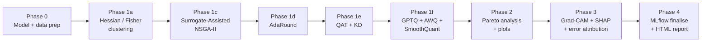

# NeuroQuant v2.0

> **Production-grade neural-network quantization** with multi-objective search,
> ONNX deployment fidelity, and built-in explainability — for **classification,
> object detection, and semantic segmentation** alike.

<p align="center">
  <em>One framework. Two front doors.</em>
</p>

<div class="grid cards" markdown>

-   :material-rocket-launch:{ .lg .middle } **CLI pipeline**

    ---

    One config file, ten phases, zero plumbing. Researchers run

    ```bash
    neuroquant --init
    neuroquant --config config.yaml --resume
    ```

    and get a full Pareto front, ONNX exports, MLflow runs, and an
    HTML report at the end.

    [:octicons-arrow-right-24: Pipeline guide](pipeline_mode.md)

-   :material-package-variant:{ .lg .middle } **Python library**

    ---

    A flat, librosa-style API for developers and notebook users.

    ```python
    from neuroquant import PTQQuantizer
    q = PTQQuantizer(model)
    q_model = q.quantize(calib_loader, bitwidth=4)
    ```

    No YAML. No pipeline. Just the quantizer you need.

    [:octicons-arrow-right-24: Library guide](library_mode.md)

</div>

---

## What ships in the box

<div class="grid cards" markdown>

-   :material-vector-difference:{ .lg .middle } **Every modern PTQ method**

    PTQ, AdaRound, GPTQ, AWQ, SmoothQuant, SmoothQuant→GPTQ, plus
    quantization-aware training (QAT) with knowledge distillation.
    Each method is config-optional and works in standalone form.

-   :material-chart-scatter-plot:{ .lg .middle } **Surrogate-Assisted NSGA-II**

    Multi-objective search over per-layer bitwidths with a
    BRP-NAS / OFA-style XGBoost surrogate that lets a single
    population scan tens of thousands of candidates per generation
    instead of dozens.

-   :material-image-multiple:{ .lg .middle } **Three vision paradigms**

    Native support for **classification**, **detection**
    (Faster R-CNN, SSD, RetinaNet, FCOS, …), and **segmentation**
    (FCN, DeepLabV3, LRASPP). One pipeline, three task families.

-   :material-eye-outline:{ .lg .middle } **Task-aware XAI**

    Grad-CAM and SHAP-style attribution that dispatch on the
    model's output shape: classification logits, detection
    score lists, *and* segmentation `OrderedDict({"out": …})`
    masks — all from the same call.

-   :material-chart-line:{ .lg .middle } **Pareto + deployment fidelity**

    True 3-objective NSGA-II (accuracy / size / ORT latency)
    with knee-point selection, ONNX export, TensorRT &
    OpenVINO hand-off for edge inference, and HTML reports
    with per-method error attribution plots.

-   :material-history:{ .lg .middle } **MLflow + resumable checkpoints**

    Every phase logs to MLflow with artefact paths and pareto
    summary JSON. The pipeline is resumable phase-by-phase, so
    a failed Phase 1f doesn't waste the 90 minutes of Phase 1c
    NSGA-II search that preceded it.

</div>

---

## The 10-phase pipeline at a glance



Every box is a standalone class you can import and call yourself
([Library mode](library_mode.md)) — or just leave the orchestrator to it
([Pipeline mode](pipeline_mode.md)).

---

## Quick install

```bash
pip install neuroquant
```

Then either drive it from the command line:

```bash
neuroquant --init              # writes config.yaml from the bundled template
neuroquant --config config.yaml
```

or use it as a library:

```python
from neuroquant import PTQQuantizer, AWQQuantizer, NSGAIIClusterSearch

# Standalone PTQ — no config, no pipeline
ptq = PTQQuantizer(my_model)
q_model = ptq.quantize(calibration_loader, bitwidth=4)
```

Full installation matrix (CUDA wheels, dev extras, docs, optional SHAP)
is on [Getting Started](getting_started.md).

---

## Where to next

-   New here? Start with [**Getting Started**](getting_started.md).
-   Running an experiment end-to-end? See [**Using the CLI Pipeline**](pipeline_mode.md).
-   Integrating into your own training script? See [**Using the Python Library**](library_mode.md).
-   Looking up a specific class? Browse the [**API Reference**](api_reference.md).
